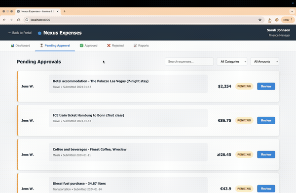
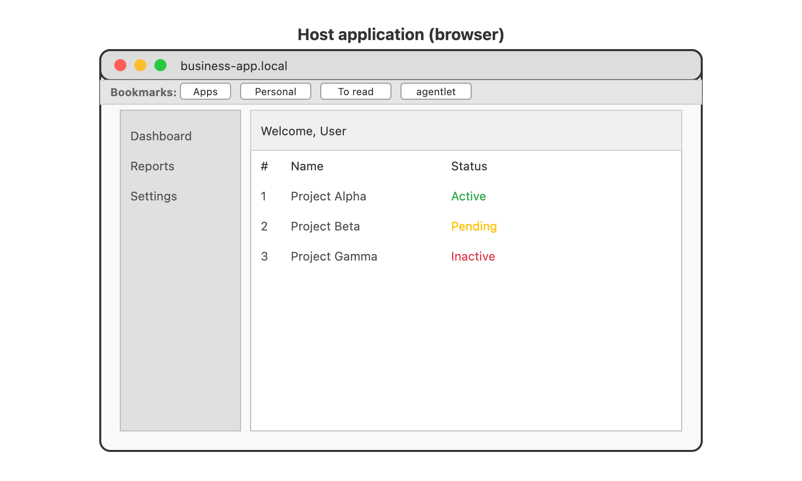
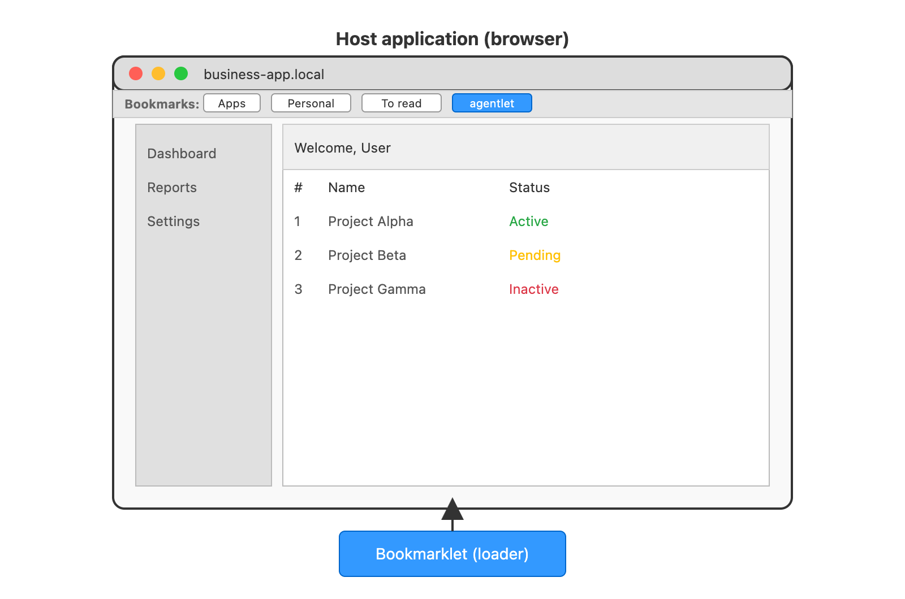
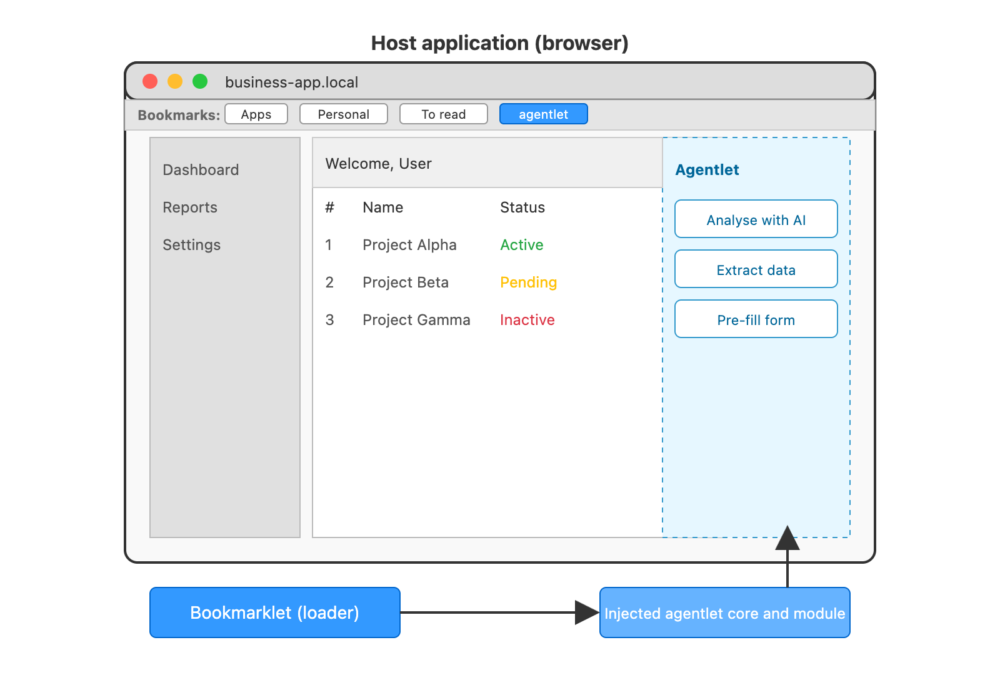
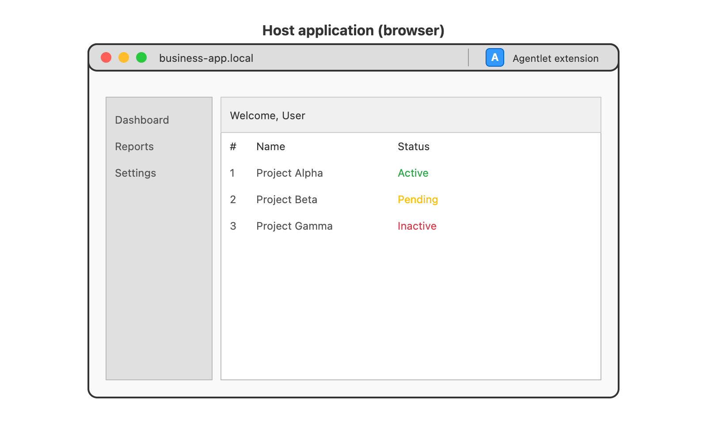
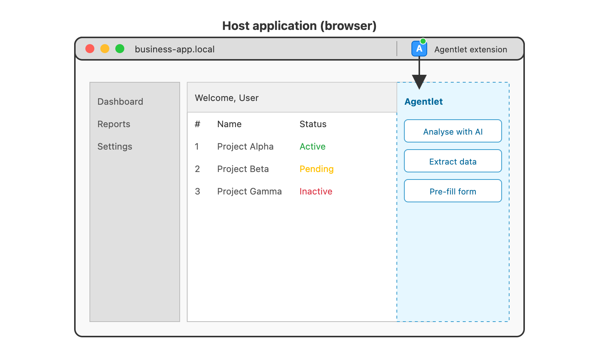

<h1 align="center" style="border-bottom: none;">📎 agentlet</h1>
<h3 align="center">Augment your web applications without friction</h3>

**Agentlet** augments existing web applications with enhanced capabilities including: form automation, data extraction, AI integration, and UX improvements — all deployed via lightweight bookmarklets or browser extensions.

This removes the immediate need for backend modifications, complex deployments, or lengthy development cycles, allowing teams to rapidly enhance user workflows and deliver tactical improvements that create strategic advantage.

> Agentlet
> *noun* (software engineering, AI systems)
>
> A lightweight, embeddable software agent injected into an existing application (typically via browser bookmarklet or extension), designed to enhance the host application with autonomous or semi-autonomous capabilities such as automation, AI, analytics, or UX augmentation — all without requiring backend changes.

**Agentlet** offers three deployment approaches: bookmarklets for instant deployment, browser extensions for enhanced capabilities, and native integration for applications that can embed the framework directly. Each approach delivers the same core augmentation capabilities while adapting to different technical environments and constraints.

These tools excel in environments where modifying the host application is impossible, prohibitively complex, or too time-consuming — transforming backend limitations into frontend opportunities.

## First demo

### Manual processing of a recurring, mundane task within a business application


### Same business application, augmented with an AI agentlet


Many more demos or examples below and in the repository!

## Highlights

Deliver tactical improvements that create strategic advantage without infrastructure changes:

- Zero backend changes required for web application enhancement
- Three deployment options: bookmarklets, browser extensions, or native integration
- Instant deployment via bookmarklet injection — no installation required
- Advanced form automation with extraction, AI processing, and intelligent filling
- Table-to-Excel export with automatic pagination handling
- Screenshot capture integration for AI-powered visual analysis
- Modular plugin architecture for custom agentlet development
- Authentication management with your existing identity provider integration
- Built-in scaffolding tools for rapid agentlet development
- CSP and CORS compliant for secure enterprise deployment

## The agentlet approach

### Guiding principles

The core philosophy behind agentlet is to offer a lightweight, flexible framework for fast, sometimes breaking, innovation that augments existing applications with minimal effort. Agentlets are designed as tactical tools: they enable teams to rapidly improve processes, test ideas, or temporarily enhance applications while waiting for more robust, long-term solutions.

Because they operate directly in the user interface, agentlets are tightly connected to how applications are actually used, making them particularly valuable in professional contexts where understanding user workflows, bottlenecks, and low-value repetitive tasks can unlock meaningful efficiency gains.

Importantly, agentlet favors speed over perfection: it’s a framework where small, targeted improvements can be deployed quickly, with the understanding that things may occasionally break and will need rapid fixing. When the complexity or weight of a feature grows too large, it’s usually a sign that agentlet is no longer the right tool.

Agentlets, whether used as bookmarklets or browser extensions, are not meant to replace deeper system integrations. Instead, they act as a practical overlay, for instance to deliver meaningful AI-powered enhancements and productivity gains without requiring backend changes. While they help bridge the gap between ideal architecture and real-world constraints, the most sustainable and robust benefits ultimately come from natively embedding AI features into the core of your application.

### Technical consequences

To apply this approach responsibly, agentlet development follows some key technical principles:

- **Focus on specific needs and pages**: design agentlets for clear, well-identified use cases, tailoring behaviors to specific pages or contexts. Avoid making them overly generic or applying changes globally — the more precise the targeting (for example, matching specific URLs), the more effective and maintainable the augmentation.

- **Respect existing styles**: align the agentlet UI with the host application’s look, without polluting or overwriting its CSS.

- **Offer opt-in features**: surface new capabilities via a side panel or on user demand, rather than imposing automatic changes.

- **Assist but don’t override**: fill out forms to save time, but never auto-submit — leave final control to the user. Also, preserve original app behavior (in practice: trigger the right JavaScript events to integrate cleanly without breaking existing interactions).

- **Stay lightweight and leverage APIs**: keep agentlet code minimal; if it becomes too heavy or complex, rethink if it still fits within the agentlet approach. When more advanced logic or data operations are needed, rely on existing backend APIs or services. This avoids overloading the front end with complex responsibilities, improves maintainability, and enables sophisticated augmentations without compromising performance or stability.

### Comparison with Robotic Process Automation

While agentlets can in some ways be seen as lightweight local RPA (Robotic Process Automation) tools, they are not true bots: they fully depend on the context of the user’s active tab and cannot autonomously operate or control the browser as a whole — they enhance, but do not replace, the user’s interaction.

| **Aspect**                              | RPA                               | Agentlet (aglt)                                   | Agentlet extension (aglx)                                | Agentlet native (agln)                                   |
|-----------------------------------------|-----------------------------------|--------------------------------------------------|---------------------------------------------------------|---------------------------------------------------------|
| **Installation / deployment**           | -- heavy *(desktop + backend install)*  | +++ lightweight *(bookmarklet injection)*        | +++ lightweight *(browser extension)*                  | ++ lightweight *(served by host app, no user install)*  |
| **Autonomy**                            | +++ fully autonomous *(no user needed)* | -- user action required *(active tab, click)*   | ++ semi-autonomous *(limited to browser & user context)* | ++ semi-autonomous *(runs in page, still user-context)* |
| **Security / scope of action**          | +++ full access *(OS, files, apps)*     | + sandboxed *(no external access, browser-only)*| ++ extended permissions *(via extension APIs, browser-limited)* | ++ sandboxed *(inside app, no external access)*         |
| **Robustness to UI changes**           | -- fragile *(UI changes often break it)*| ++ can be robust *(with good selectors, JS)*    | ++ same as agentlet                                   | +++ very robust *(tight to app code, controlled env)*   |
| **Performance**                         | -- often slow *(simulates human actions)*| +++ instant *(direct DOM manipulation)*         | +++ same as agentlet                                  | +++ same as agentlet                                   |
| **Relies on user context**              | +++ yes                                | +++ yes                                         | +++ yes                                               | +++ yes                                                |
| **Interacts with page like user**       | +++ yes                                | +++ yes                                         | +++ yes                                               | +++ yes                                                |
| **Goes beyond current page**           | +++ yes                                | -- only within SPA *(single page app)*         | ++ yes *(cross-page within browser)*                 | -- only within app *(single page or app context)*      |
| **Goes beyond browser**                | +++ yes *(system-wide)*                | -- no                                           | -- no                                                | -- no                                                 |
| **Interacts with embedded elements**   | -- limited *(surface-level only)*       | +++ deep *(full DOM access, manipulation)*      | +++ deep *(same, with extension APIs)*               | +++ deep *(inside app, full access to app DOM)*       |

## The agentlet ecosystem

The agentlet ecosystem includes a core framework, a collection of example implementations, and a specialized tool called the `agentlet-designer`, a dedicated agentlet for creating custom agentlets tailored to specific applications.

`agentlet-core` is the foundation that provides core capabilities. Developers can then build their own agentlets on top of it.

Agentlet also offers a demo repository (`agentlet-demo-apps`) containing AI-generated, mocked business applications designed for testing and neutral demo use.

### Core library

This is the main repository, providing a JavaScript framework that lays the foundation for quickly building agentlets — whether as standard bookmarklets, browser extensions, or native agentlets.

Key features of the framework include:
- Core classes and a module loader for implementing custom agentlets;
- A build system to help kickstart small projects;
- Core utility components addressing common technical and functional needs of agentlets;
- Documentation and example implementations;
- Test suites.

#### Utility components

`agentlet-core` currently includes the following components to simplify the development of _agentlets_:

- **Element selector**: Adds dynamic element selection to your agentlets, with the ability to restrict selection to specific element types (e.g., forms, tables, images).
- **Screenshot capture**: Built-in integration with HTML2Canvas enables rendering any web page element as an image or base64, ideal for feeding into AI models.
- **Form extractor**: Extracts structured data from forms, including field names, labels, placeholders, current values, options, and bounding boxes.
- **Form filler**: Automatically fills out forms using structured data. You can chain the form extractor → AI model → form filler to automate form completion.
- **Table extractor**: Extracts structured data from tables, including support for paginated tables.
- **Excel generator**: Creates Excel spreadsheets on the fly using _SheetJS (JS-XLSX)_, typically used alongside the table extractor.
- **Dialog functions**: Provides methods to display information, collect user input, wait, show tooltips or bubbles, and more.
- **Data access**: Retrieves information from cookies and local storage.
- **Environment management**: Manages local environment variables.
- **Authentication**: Supports integration with various identity providers.
- **Script injector**: Easily runs JavaScript code via bookmarklets or browser extensions.

These components give AI developers the tools to quickly build agentlets that augment web applications. While backend AI APIs (such as OpenAI or AWS Bedrock) and proper authentication are still required for advanced features, agentlet offers a solid foundation to easily connect and integrate these services.

## Getting started

### Quick Demo

**Option 1: Run built-in examples (Recommended)**

```bash
cd agentlet-core
npm install
npm run demo  # Builds library + starts dev server + opens browser
```

This automatically:
- Builds the Agentlet Core library
- Starts a development server on `http://localhost:3000`
- Opens your browser to the examples page
- Serves all examples with proper CORS headers for bookmarklet testing

**Alternative commands:**
```bash
npm run examples  # Same as npm run demo
npm start         # Same as npm run demo  
npm run dev       # Just starts server (no build)
```

### Create Custom Agentlet

**Option 2: Build a custom agentlet**

This command creates a working demo agentlet named `my-agentlet` within `agentlet-core/../my-agentlet/`, pre-packaged with all required external libraries.

```bash
npm run scaffold:agentlet:defaults
```

You can remove the `:defaults` option should you want to scaffold a demo agentlet with other settings. They will be asked in the interactive scaffolding.

**Run the custom agentlet:**

```bash
cd ../my-agentlet
npm install
npm run build
npm start
```

### Manual Setup

**Option 3: Manual build and setup**

```bash
cd agentlet-core
npm install
npm run build
```

This creates:
- `dist/agentlet-core.js` - Development version
- `dist/agentlet-core.min.js` - Production version  
- `dist/bookmarklet.js` - Bookmarklet version
- `dist/bookmarklet.html` - Installation page

## Architecture

_Agentlets_ integrate directly into the context of an existing webpage, following an unconventional software architecture that developers need to understand. While this approach offers integration advantages, it also introduces specific security considerations. To address this, the agentlet framework adheres to common web and API security principles, notably **Content Security Policy (CSP)** and **Cross-Origin Resource Sharing (CORS)** (see below).

### Bookmarklet architecture

A bookmarklet is a small JavaScript snippet stored as the URL of a browser bookmark. When you click the bookmark, the browser executes that JavaScript in the context of the currently loaded webpage.

This mechanism allows you to interact programmatically with the page’s content, modify its behavior, or inject additional functionality — all without installing browser extensions or altering the page’s source code.

In technical terms, a bookmarklet works like this:
- The bookmark’s href starts with javascript:, followed by inline JavaScript code.
- When triggered, this code runs within the page’s JavaScript environment (i.e., as if you ran it in the developer console).
- For small tasks, the bookmarklet’s inline code may be sufficient (try to create a browser bookmark whose url is `javascript:alert('Hello world!');`).
- For more complex functionality, the bookmarklet typically injects an external script by dynamically creating a <script> tag pointing to a remote JavaScript file. Coming with some security constraints, this allows you to load larger codebases without exceeding the size limits or encoding constraints of the bookmarklet itself.
- With some additional constraints, the injected code can in turn perform calls to some APIs to augment the current page with some additional capabilities.

Technical constraints to be aware of:
- Bookmarklet code must be URL-encoded, which can make long or complex scripts cumbersome.
- Modern browsers typically impose security restrictions, such as blocking cross-origin requests or mixed-content loading.
- Since the code runs in the context of the current page, it can interact with page elements but also inherits any JavaScript quirks or conflicts from that environment.
- Loading external scripts depends on network availability and correct CORS (Cross-Origin Resource Sharing) http headers.
- The bookmarklet’s injected code only lives in memory for the current page session. If you perform a full page reload (e.g., using F5 or Ctrl-R), the page resets, and any injected scripts are cleared — you’ll need to activate the bookmarklet again. However, in many modern web applications built as Single Page Applications (SPAs), navigation between views or routes happens without a full reload. This means the injected code can persist across in-app navigation as long as the page isn’t fully refreshed.

In short, bookmarklets offer a lightweight, extension-free way to enhance or manipulate web pages on the fly — but they operate under some technical limitations that developers should design around.

To help navigate these constraints, the agentlet framework provides build scripts that package JavaScript code appropriately, generate both the bookmarklet link and the external script to be injected, and offer components for persistent storage within the page context, allowing agentlets to maintain state across interactions.

|  Bookmarklet architecture                                                        |
|----------------------------------------------------------------------------------|
|                                       |
| 1: Web application is loaded within browser - standard behavior                  |
|                                       |
| 2: Bookmarklet clicked and JS loader runs within page context                    |
|                                       |
| 3: Import and inject agentlet core and modules, also running within page context |


### Browser extensions vs bookmarklets

Browser extensions are installable software modules that extend the capabilities of web browsers. Unlike bookmarklets, which run as one-off JavaScript snippets injected into the current page, extensions integrate directly with the browser, giving them access to specialized browser APIs and persistent background scripts.

Some key differences between browser extensions and bookmarklets:

- **Capabilities**: Extensions can access privileged APIs (e.g., tabs, storage, cookies, webRequest), run background scripts, inject content scripts automatically across specified sites, and display UI elements (like toolbar buttons or popups). In comparison, bookmarklets are limited to running JavaScript in the context of the current page and only when manually triggered.

- **Persistence**: Extensions can maintain persistent state and behavior across browsing sessions. Bookmarklet-injected code only lives until the page is reloaded or navigated away from (though SPAs may allow it to linger across internal navigation).

- **Deployment and distribution**: Bookmarklets require no installation — they’re just links the user can add to their bookmarks bar. Extensions, however, require packaging, signing, and distribution through browser extension stores (like the Chrome Web Store or Firefox Add-ons), which can introduce approval, update, and security constraints.

- **Security context**: Extensions operate in a sandboxed, privileged context separate from the webpage, reducing some risks of interference but also introducing complexity in message passing between extension scripts and page scripts.

Moving from a bookmarklet to an extension is often a natural evolution when the injected code grows beyond the bookmarklet’s technical limits — for example, needing persistent background behavior, access to browser-level data, automatic injection on specific sites, or a richer user interface. However, it also means adopting additional tooling, build steps, and maintenance overhead (including keeping up with browser API changes and store policies).

In short, while bookmarklets offer a lightweight and installation-free way to enhance web pages, browser extensions unlock deeper integration at the cost of greater complexity and distribution effort.

The agentlet framework provides build mechanisms to quasi-seamlessly transform a bookmarklet into a browser extension, making it easier to scale from simple page injections to fully integrated browser tooling when needed.

|  Extension architecture                                                               |
|---------------------------------------------------------------------------------------|
|                                              |
| 1: Web application is loaded within browser - extension is already installed          |
|                                              |
| 2: Extension launches agentlets (script already present within the extension bundle)  |

### Native integration architecture

In some cases, the functionality provided by a bookmarklet can be integrated natively into the host website’s frontend. This means the same JavaScript code that would normally be injected at runtime by the bookmarklet is instead loaded directly by the website itself — for example, by adding a `<script>` tag in the page template or dynamically loading the agentlet bundle.

This approach is especially useful in environments where deploying new backend features is cumbersome or slow, but adding or updating frontend assets is simpler (such as in many corporate or internal applications). By distributing agentlet functionality as part of the frontend, teams can provide advanced, modular capabilities without requiring backend deployments, API changes, or server updates — effectively “graduating” a bookmarklet-based feature into a natively integrated frontend component.

### Security considerations

#### Content Security Policy (CSP)

CSP headers restrict which domains can serve content within a page. Typically, this includes the domain hosting the web app, its APIs, and associated CDNs. In corporate environments, a common pattern is to deploy your AI API within an existing trusted domain and serve the agentlet (minified JavaScript) from your corporate CDN. This approach enables the bookmarklet to inject code into the page (permitted if hosted on an allowed domain per CSP), and subsequently lets the agentlet interact with internal APIs.

#### Cross-Origin Resource Sharing (CORS)

Your backend APIs must implement appropriate CORS headers to allow requests from the domain where the agentlet runs—typically your internal corporate web application.


## Credits & Acknowledgments

### Core Dependencies

The agentlet framework is built on several excellent open-source libraries:

- **[PDF.js](https://mozilla.github.io/pdf.js/)** - Mozilla Foundation - PDF rendering and processing
- **[html2canvas](https://html2canvas.hertzen.com/)** - HTML to canvas screenshot generation  
- **[SheetJS](https://sheetjs.com/)** - Excel file generation and manipulation
- **[jQuery](https://jquery.com/)** - DOM manipulation and utilities (optional bundled version)

### Testing & Development

- **[Jest](https://jestjs.io/)** - JavaScript testing framework
- **[JSDOM](https://github.com/jsdom/jsdom)** - DOM implementation for testing
- **[Rollup](https://rollupjs.org/)** - Module bundler for distribution builds

## License

MIT - See LICENSE file for details.

## Contributing

1. Fork the repository
2. Create a feature branch
3. Make your changes
4. Add tests if applicable
5. Submit a pull request

For module contributions, consider publishing to the module registry for community use.
